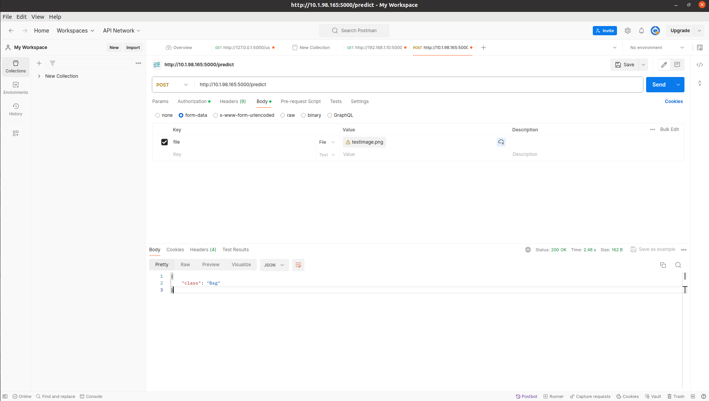
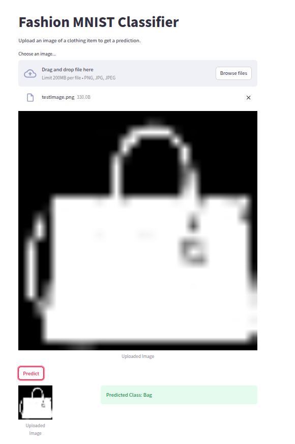

# Report 

## **Fashion MNIST Classification with ResNet18**

This project trains a **ResNet18** model to classify **Fashion MNIST** images and serves predictions through a **Flask API (backend)** and a **Streamlit frontend**. Both components are containerized using **Docker** and are be deployed together on [Fashion MNIST](https://fashionmnistfrontend.onrender.com). 

Github Link: [Project Repository](https://github.com/roja26/FashionMNIST)


## **Project Structure**
```
.
├── backend/                 # Flask API to serve model predictions
│   ├── api.py               # FastAPI/Flask app for inference
│   ├── Dockerfile           # Dockerfile for backend service
│   ├── requirements.txt     # Dependencies for backend
│
├── data/                    # Directory to store any required data
│
├── frontend/                # Streamlit frontend for user interaction
│   ├── app.py               # Streamlit app for image upload & prediction
│   ├── Dockerfile           # Dockerfile for frontend service
│   ├── requirements.txt     # Dependencies for frontend
│
├── images/                  # Images for report
│
├── best_model_cpu.onnx      # Best model saved as onnx
├── best_model.pth           # Best model save in pytorch format
├── docker-compose.yml       # Orchestrates backend & frontend containers
├── FashionMNIST.ipynb          # Jupyter Notebook with model training, evaluation, and explanations
├── README.md                # Documentation
├── testImage.png            # Sample image for testing
```

---
## **Part 1 & 2: Data Preprocessing, Model Training & Evaluation**

- Note: Detailed explanation also provided in FashionMNIST.ipynb in markdown cells for steps taken for data preprocessing, feature engineering, model selection and optimization approach.


### **1. Data Preprocessing**  
The **FashionMNIST.ipynb** notebook includes preprocessing steps for the **Fashion MNIST** dataset, which consists of **70,000 grayscale 28×28 images** across **10 fashion categories**. This dataset is balanced, ensuring fair training without bias.  

- **Why Fashion MNIST?**  
  - Small size enables faster training and experimentation.  
  - More complex patterns than MNIST, making it a better benchmark.  
- **Training Setup**  
  - **Batch Size: 256**, leveraging the parallel processing power of Nvidia RTX GPUs.  
  - **Data Augmentation:** Rotation and flipping improve model robustness.  
  - **num_workers = 2**, optimizing data loading without overloading system resources.  

### **2. Model Training with ResNet18**  
- **Why ResNet18?**  
  - Efficient deep feature extraction for small grayscale images.  
  - Modified first convolution layer for **single-channel input** and final FC layer for **10 classes**.  
- **Optimization Techniques:**  
  - **Loss Function:** CrossEntropyLoss with **label smoothing (0.1)** to reduce overconfidence.  
  - **Optimizer:** AdamW (**weight decay = 1e-4**) for adaptive learning and regularization.  
  - **Learning Rate Scheduler:** ReduceLROnPlateau (**patience = 3 epochs**) lowers LR when validation loss stagnates.  
  - **Early Stopping:** Stops training if no improvement for **5 epochs**, preventing overfitting.  
  - **Best Model Saving:** Model is saved whenever validation loss improves.  

### **3. Model Evaluation**  
- **Performance Metrics:**  
  - **Test Accuracy: 93.64%**  
  - Train and validation loss decrease consistently, confirming effective learning.  
  - Early stopping was triggered, preventing overfitting.  
- **Classification Insights:**  
  - Most classes (1,000 samples each) are well-classified, but **similar categories like T-shirt/top & Shirt** and **Shirt & Coat** show some misclassification due to overlapping features.  
  - The **classification report** highlights precision, recall, F1-score, and support. **Lower recall in similar categories** suggests difficulty in distinguishing subtle shape and texture differences.  

### **4. BONUS: SHAP Explanations**  
- SHAP heatmaps show that the **model focuses on key distinguishing features** like necklines or soles.  
- High-importance pixels align with the **overall shape of the clothing item**, confirming that the model correctly identifies relevant visual patterns for classification.  

By combining **data augmentation, efficient optimization, and explainability techniques**, the model achieves **high accuracy and generalization** for Fashion MNIST classification.

---

## Part 3: Model Deployment
This project consists of a **Flask-based API (backend) for model predictions** and a **Streamlit web interface (frontend) for user interaction**. Both components are containerized using **Docker** for easy deployment.  

## 1. **Backend - Flask API**
The **Flask API (`api.py`)** serves as the backend, handling image classification requests, loads **best_model.pth**, takes an image as input, and returns a predicted class.

### **Key Features:**  
- Uses **ResNet18**, modified for **grayscale (1-channel) images** and **10-class classification**.  
- Implements **basic authentication** to restrict API access.  
- Accepts image uploads via a **POST request to `/predict`**.  
- Preprocesses images to **28×28 grayscale, normalizes them**, and feeds them into the model.  
- Returns the **predicted clothing category** as JSON.  
- Includes **logging** for debugging and security.  

### **Endpoints**
- `POST /predict`
  - Input: Image file
  - Output: JSON response with predicted class

### **How It Works:**  
1. Loads the trained **FashionMNIST ResNet18 model** (`best_model.pth`).  
2. Uses **CrossEntropyLoss with label smoothing** to improve generalization.  
3. Authenticates requests using **basic authentication (`admin/password`)**.  
4. Receives image uploads, processes them using **Torchvision transforms**, and predicts the class.  
5. Returns the **predicted class label (e.g., "Sneaker", "T-shirt/top")** as JSON.  

### **Testing the API:**  
- Use **Postman** or **CURL** to send an image for classification.  
- Example request using CURL:  
  ```bash
  curl -X POST -F "file=@testImage.png" -u admin:password http://localhost:5000/predict
  ```  



## 2. BONUS: **Frontend - Streamlit UI**
The **frontend (`app.py`)** provides a simple **web UI using Streamlit**, allowing users to upload images and receive predictions.  , this is using the backed in `backend/api.py`

### **Key Features:**  
- **User-friendly web interface** for easy image upload and prediction display.  
- **Integrates with the Flask API**, sending image files for classification.  
- Uses **PIL (Pillow)** to handle image conversion and processing.  
- Displays **uploaded image** alongside the **predicted class label**, upon clicking predict button.  

### **How It Works:**  
1. Users upload an image (PNG, JPG, JPEG).  
2. The image is **converted to grayscale** and sent to the backend API.  
3. The Flask API **returns the predicted class**, which is displayed in the UI.  
4. Users see **both the uploaded image and the prediction**.  

### **Example Request to API:**  
```python
response = requests.post(API_URL, files={"file": image_bytes}, auth=("admin", "password"))
```


---

## **Installation & Running the Project**

### **1. Using Docker (Recommended)**
Ensure **Docker** and **Docker Compose** are installed.

Run the project using:
```sh
docker compose build
docker compose up
```
or

```sh
sudo docker compose build
sudo docker compose up
```
This will start:
- **Backend (Flask API)** at `http://localhost:5000`
- **Frontend (Streamlit UI)** at `http://localhost:8501`

**Note**: About Docker implementation, follwing files were added-
- `backend/Dockerfile`: Defines the container for the Flask API, installing dependencies and setting up the environment to serve predictions.
- `frontend/Dockerfile`: Defines the container for the Streamlit frontend, ensuring it can interact with the backend API.
- `docker-compose.yml`: Orchestrates both containers, allowing them to run simultaneously. It sets up network communication between the backend and frontend, ensuring seamless interaction.

### **2. Running Without Docker**
#### **Backend (Flask API)**
```sh
cd backend
pip install -r requirements.txt
python api.py
```
#### **Frontend (Streamlit)**
```sh
cd frontend
pip install -r requirements.txt
streamlit run app.py
```
---

## Details About Deployment

Used Render to deploy backend and frontend.

- The deployment strategy for the Fashion MNIST classifier ensures accessibility and ease of use through a Dockerized backend and frontend hosted on Render, a free and simple cloud platform. The entire application is first pushed to GitHub to enable seamless integration with Render. 
- To ensure smooth communication between the frontend and backend, the API URL in the Streamlit app is updated to match the deployed backend endpoint before committing changes to GitHub, triggering an automatic redeployment on Render. This approach eliminates manual server management while providing a fully functional and publicly accessible web application, making deployment both cost-effective and scalable.

Backend is deployed on - https://fashionmnistbackend.onrender.com
API Endpoint to Use for predictions - https://fashionmnistbackend.onrender.com/predict
Frontend is deployed on - https://fashionmnistfrontend.onrender.com

**Note:** Based on using locally, dockerized or deployed version `API_URL` in `frontend/app.py` will change. Options are provided in the file.


